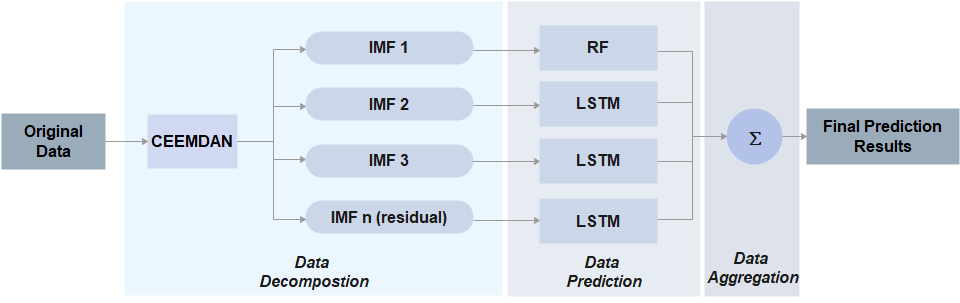

 

<h1 align="center"> Building Energy Consumption Prediction  </h1>
<h3 align="center"> A hybrid RF-LSTM based on CEEMDAN for improving the accuracy of building energy consumption prediction </h3>  
 
 
This is the original source code used for all experiments in the paper  *"A hybrid RF-LSTM based on CEEMDAN for improving the accuracy of building energy consumption prediction"* 

 
Access this Binder by clicking the blue badge above or at the following URL:
 
https://mybinder.org/v2/gh/irenekarijadi/RF-LSTM-CEEMDAN/HEAD

## Authors
*Irene Karijadi, Shuo-Yan Chou*

*corresponding author: irenekarijadi92@gmail.com (Irene Karijadi)*

<!-- TABLE OF CONTENTS -->
<h2 id="table-of-contents"> :book: Table of Contents</h2>

  
Table of Contents

  <ol>
    <li><a href="#Background"> ➤ Background</a></li>
    <li><a href="#Framework"> ➤ Framework</a></li>
    <li><a href="#Prerequisites"> ➤ Prerequisites</a></li>
    <li><a href="#Description-of-files"> ➤ Description of files</a></li>
    <li><a href="#Dataset"> ➤ Dataset</a></li>
    <li><a href="#Parameter-Setting"> ➤ Parameter Setting</a></li>
    <li><a href="#Reproducibility-workflow"> ➤ Reproducibility workflow</a></li>
  </ol>

<!-- Background -->
<h2 id="Background"> :pencil: Background</h2>

 
An accurate method for building energy consumption prediction is important for building energy management system. However, building energy consumption data often exhibits  nonlinear and nonstationary patterns, which makes prediction more difficult. In this study, we proposed a hybrid method of Random Forest (RF), and Long Short-Term Memory (LSTM) based on Complete Ensemble Empirical Mode Decomposition with Adaptive Noise (CEEMDAN) to predict building energy consumption.

   
<!-- Framework-->
<h2 id="Framework"> :page_with_curl: Framework</h2>
This is the framework of the proposed method

          
  <!--figcaption>Caption goes here</figcaption-->

<!-- PREREQUISITES -->
<h2 id="prerequisites"> :file_folder: Prerequisites</h2>

The proposed method is coded in Python 3.7.6 and the experiments were performed on Intel Core i3-8130U CPU, 2.20GHz, with a memory size of 4.00 GB.
The python version is specified in [runtime.txt.](https://github.com/irenekarijadi/RF-LSTM-CEEMDAN/blob/main/runtime.txt)
In order to run the experiments, a number of packages need to be installed. Here are the list of the package  version that we used to run all the experiments

* EMD-signal==0.2.10
* pandas==0.25.3
* keras==2.4.3
* tensorflow>=2.0.0
* sklearn==0.22.1
* numpy==1.18.1
* matplolib
* dataframe_image

The complete list of packages can be found in [requirements.txt.](https://github.com/irenekarijadi/RF-LSTM-CEEMDAN/blob/main/requirements.txt)

<!-- Description of File -->
<h2 id="Description of File"> :floppy_disk: Description of File</h2>

This  includes 3 executable files, 3 text files as well as 2 directories as follows:

Non-Python files:

filename                          |  description
----------------------------------|------------------------------------------------------------------------------------
Dataset                           |  Data used in this study can be found in Dataset directory 
Figures                           |  Generated graphics and figures to be used in reporting
README.md                         |  The README file for using this code
License                           | License file

Python files:

filename                                               |  description
-------------------------------------------------------|------------------------------------------------------------------------------------
1. Experiments for University Dormitory Building.ipynb | This is the main file used to conduct all the experiments using parameter settings specified in Setting.ipynb.
! main.ipynb                      | This is the main file used to conduct all the experiments using parameter settings specified in Setting.ipynb.
! main.ipynb                      | This is the main file used to conduct all the experiments using parameter settings specified in Setting.ipynb.
! main.ipynb                      | This is the main file used to conduct all the experiments using parameter settings specified in Setting.ipynb.
! main.ipynb                      | This is the main file used to conduct all the experiments using parameter settings specified in Setting.ipynb.
Setting.ipynb                     | This is a file used to set a number of parameters that are used throughout the functions in the directory
Plot Dataset.ipynb                | This file contains the script to visualize the data
Linear_regression.ipynb           | This file includes all functions required for Linear Regression that are used in the experiments
Support_vector_regression.ipynb   | This file includes all functions required for SVR that are used in the experiments
Artificial_neural_network.ipynb   | This file includes all functions required for ANN that are used in the experiments
Random_forest.ipynb               | This file includes all functions required for RF that are used in the experiments
lstm.ipynb                        | This file includes all functions required for LSTM that are used in the experiments
hybrid_ceemdan_rf.ipynb           | This file includes all functions required for Hybrid CEEMDAN RF that are used in the experiments
hybrid_ceemdan_lstm.ipynb         | This file includes all functions required for Hybrid CEEMDAN LSTM that are used in the experiments
Proposed_method.ipynb             | This file includes all functions required for Proposed Method that are used in the experiments

## Dataset

We used a public dataset from the [Building Data Genome Project](https://www.google.com/search?q=building+data+genome+project&oq=Building+Data+Genome+Project&aqs=chrome.0.35i39j69i59l2j69i64j69i59j69i60l3.558j0j7&sourceid=chrome&ie=UTF-8) 

Five different buildings are used in this study and you can download it here:
[Office Building](https://github.com/irenekarijadi/RF-LSTM-CEEMDAN/blob/main/Dataset/data%20of%20Office_Abigail.csv), [University Classroom Building](https://github.com/irenekarijadi/RF-LSTM-CEEMDAN/blob/main/Dataset/data%20of%20UnivClass_Abby.csv),[University Dormitory Building](https://github.com/irenekarijadi/RF-LSTM-CEEMDAN/blob/main/Dataset/data%20of%20UnivDorm_Prince.csv),[University Laboratory Building](https://github.com/irenekarijadi/RF-LSTM-CEEMDAN/blob/main/Dataset/data%20of%20UnivLab_Christy.csv), [Primary Classroom Building](https://github.com/irenekarijadi/RF-LSTM-CEEMDAN/blob/main/Dataset/data%20of%20PrimClass_Jaden.csv)

To visualize hourly energy consumption from five buildings, please  running the [Plot Dataset.ipynb](https://github.com/irenekarijadi/RF-LSTM-CEEMDAN/blob/main/Plot%20Dataset.ipynb)

## Setting
A number of parameters (e.g. LSTM learning rate, RF feature number, etc) are defined in the [Setting.ipynb](https://github.com/irenekarijadi/RF-LSTM-CEEMDAN/blob/main/Setting.ipynb)

## Reproducibility workflow

1. In order to run the model, the packages need to be installed first using this code:
`pip install -r requirements.txt()`
2. To visualize the data, run the [Plot Dataset.ipynb](https://github.com/irenekarijadi/RF-LSTM-CEEMDAN/blob/main/Plot%20Dataset.ipynb)
3. For experiments, the results of the proposed method and other benchmarking methods can be obtained by running the [! main.ipynb](https://github.com/irenekarijadi/RF-LSTM-CEEMDAN/blob/main/!%20main.ipynb)

### Results from [! main.ipynb](https://github.com/irenekarijadi/RF-LSTM-CEEMDAN/blob/main/!%20main.ipynb)
The performance of the proposed method was compared with other prediction methods, including linear regression (LR), random forest (RF), support vector regression (SVR), Artificial Neural Network, Long Short-Term Memory (LSTM), Complete Ensemble Empirical Mode Decomposition with Adaptive Noise-Random Forest (CEEMDAN-RF), and Complete Ensemble Empirical Mode Decomposition with Adaptive Noise - Long Short-Term Memory (CEEMDAN-LSTM). 
According to the experimental results obtained from running [! main.ipynb](https://github.com/irenekarijadi/RF-LSTM-CEEMDAN/blob/main/!%20main.ipynb) file, the proposed method has the lowest error and has the best prediction accuracy among the benchmark methods.

### Percentage Improvement
We further measure the improvement of the proposed method to other benchmarking methods.
The percentages of error improvement with other benchmark methods are computed in the file [! main.ipynb](https://github.com/irenekarijadi/RF-LSTM-CEEMDAN/blob/main/!%20main.ipynb)

